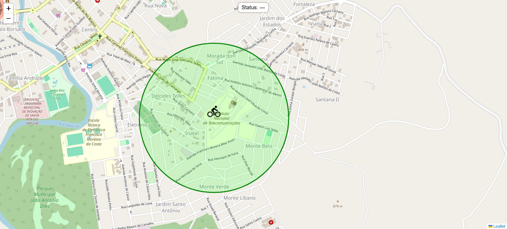

# Bike Tracker 🚲

Este projeto, desenvolvido como parte da disciplina C115 - Conceitos e Tecnologias para Dispositivos Conectados, implementa um simulador de um **Sistema IoT Rastreador de Bicicletas**. A aplicação permite simular a movimentação de uma bicicleta em tempo real e exibir um mapa com a área segura, além do status (SAFE ou OUT_OF_ZONE).



## Tecnologias Utilizadas

- **MQTT**: Comunicação entre o dispositivo IoT (simulado) e a aplicação
- **Backend**: Python, FastAPI, Paho-MQTT
- **Frontend**: HTML, CSS, JS (Leaflet.js para o mapa)
- **Socket.IO**: Comunicação em tempo real entre backend e frontend

## Como Usar

### Pré-requisitos

- Navegador web (Chrome, Firefox, Safari, Edge)
- Python 3.10+

### Instalação e Execução

1. Clone o repositório:

    ```bash
    git clone https://github.com/mathzpereira/c115-mqtt-bike-tracker.git
    ```

2. Navegue até o diretório do projeto:

    ```bash
    cd c115-mqtt-bike-tracker
    ```

3. Instale as dependências:

    ```bash
    pip install -r requirements.txt
    ```

4. Inicialize o backend:

    ```bash
    uvicorn main:socket_app --reload
    ```

5. Abra outro terminal e inicialize o publisher:

    ```bash
    python publisher.py
    ```

6. Acesse a aplicação em seu navegador:
   ```bash
   http://localhost:8000
   ```

## Autor

### Matheus Pereira - [GitHub](https://github.com/mathzpereira)